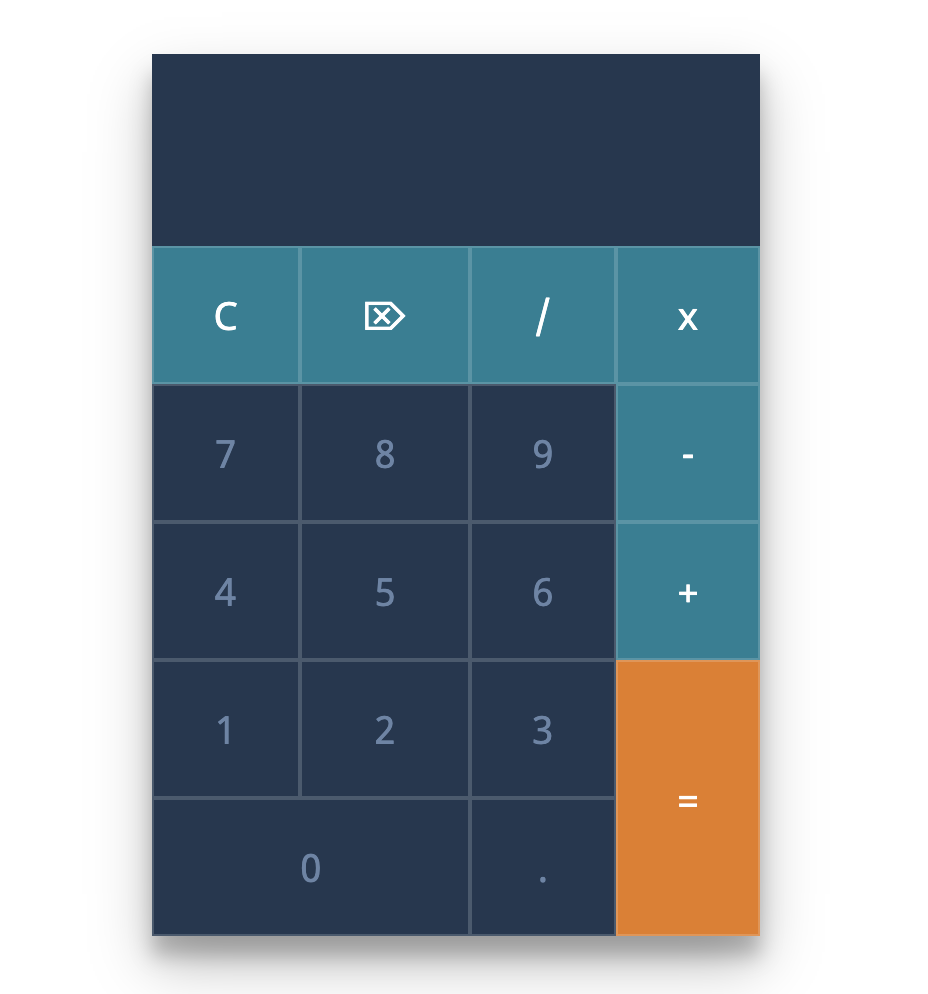

# Project Calculator

Ideme vytvorit webovu aplikáciu Calculator.
Bude vyzerat takto:

Postup:
1. naklonujte si tento repozitar k sebe:
`git clone https://github.com/branecko/calculator.git`

2. v subore `app.js` najdete niekolko uloh